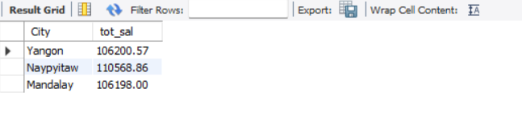
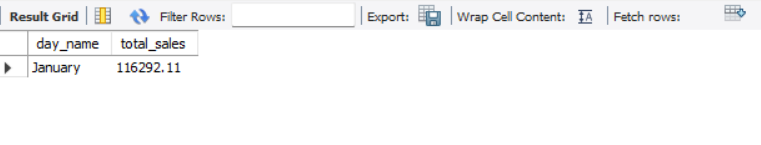
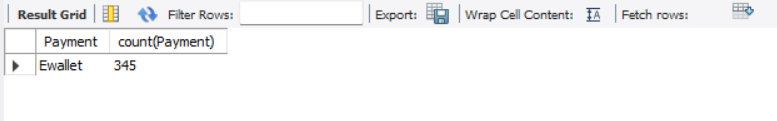
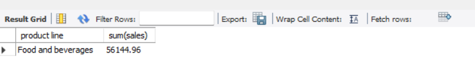

# Supermarket Sales Analysis (SQL Project)

## Project Overview
This project analyzes supermarket sales data using SQL to discover useful business insights such as sales trends, customer purchasing behavior, and product performance.

## Tools Used
- MySQL
- SQL
- Excel Dataset

## Dataset
The dataset contains supermarket transaction records including:

- Invoice ID
- Branch
- City
- Customer Type
- Gender
- Product Line
- Unit Price
- Quantity
- Tax
- Total Sales
- Date and Time
- Payment Method
- Gross Income
- Rating

Dataset file available in this repository.

## Dataset Preview

---

## Business Questions Solved

This project answers several business questions using SQL queries:

1. What is the total number of transactions?
2. What is the total sales revenue?
3. What is the total quantity of products sold?
4. What is the average rating of the supermarket?
5. Which city has the highest total sales?
6. Which branch generates the highest revenue?
7. Which product line has the highest sales?
8. Which product line sold the highest quantity?
9. Which payment method is used the most?
10. Which product line generates the highest gross income?
11. Which city has the highest average rating?
12. Which customer type generates the highest sales?
13. Which branch has the highest average gross income?
14. Which day of the week has the highest sales?
15. Which month has the highest total sales?
16. Which gender spends more on average?
17. Which time of the day has the highest transactions?

---

## SQL Analysis Results

### Sales by City

### Monthly Sales Trend

### Most Used Payment Method

### Top Selling Product Line

### Transactions by Time of Day

---

## SQL File
All SQL queries used for the analysis are available in the file:

`super market sales analysis.sql`

---

## Key Insights

- Certain cities generate significantly higher sales revenue.
- Some product lines contribute more to total sales.
- Customers prefer specific payment methods.
- Sales vary depending on time of the day and month.
- Customer type influences purchasing behavior.

---

## Author

Harini Selvaraju  
B.Tech Information Technology Student  
Aspiring Data Analyst
