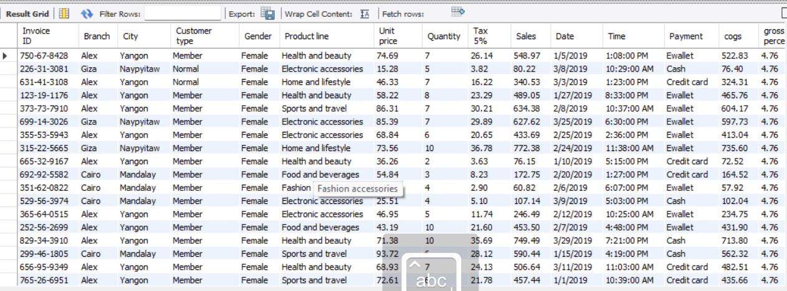
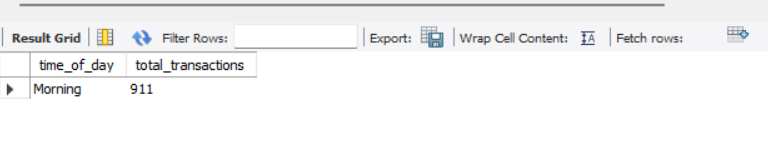

# Supermarket Sales Analysis (SQL Project)

## Project Overview
This project analyzes supermarket sales data using SQL queries to extract business insights.

## Tools Used
- MySQL
- SQL
- Excel Dataset

## Dataset Preview

## Sales by City

## Monthly Sales Analysis

## Payment Method Analysis

## Top Product Line

## Transactions by Time

## SQL Queries
The SQL queries used for analysis are available in the file:

`super market sales analysis.sql`

## Insights
- Identified top performing cities
- Analyzed monthly sales trends
- Found the most used payment method
- Determined the best selling product line
